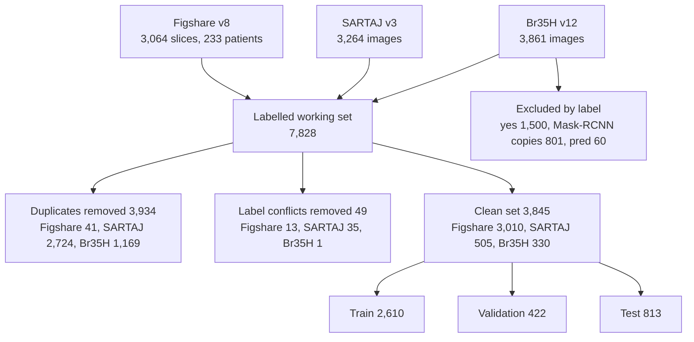

# Data Flow, Step 1.4 Revision 3

```mermaid
flowchart TD
  A["Figshare v8<br/>3,064 slices, 233 patients"] --> W
  B["SARTAJ v3<br/>3,264 images"] --> W
  C["Br35H v12<br/>3,861 images"] --> W
  C --> X["Excluded by label<br/>yes 1,500, Mask-RCNN copies 801, pred 60"]
  W["Labelled working set<br/>7,828"] --> D["Duplicates removed 3,934<br/>Figshare 41, SARTAJ 2,724, Br35H 1,169"]
  W --> K["Label conflicts removed 49<br/>Figshare 13, SARTAJ 35, Br35H 1"]
  W --> G["Clean set 3,845<br/>Figshare 3,010, SARTAJ 505, Br35H 330"]
  G --> T1["Train 2,610"]
  G --> T2["Validation 422"]
  G --> T3["Test 813"]
```
